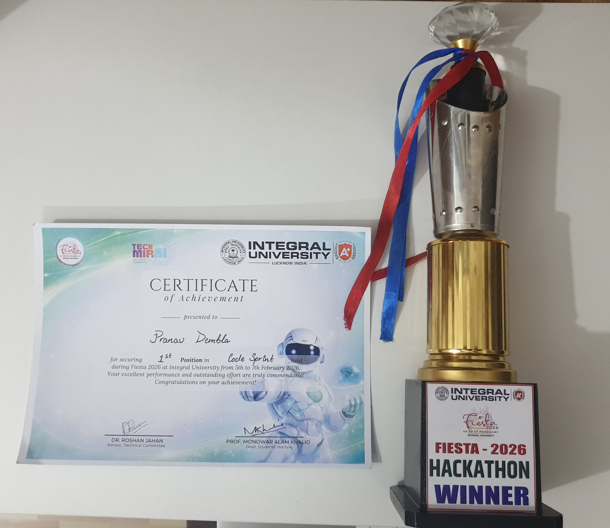

# Club Management System - CodeSprint Hackathon



## 📌 Overview
This project was developed during the **CodeSprint One-Day Hackathon**. It is a functional prototype of an **Event & Club Management System** designed to streamline event organization, participant registration, and communication within campus organizations.

---

## 🚀 Problem Statement
Student clubs often face challenges with **manual registrations, scattered communication, and poor tracking**, leading to operational chaos. 

### Objective
To build a prototype that manages:
1.  **Registrations:** Efficient participant sign-up and tracking.
2.  **Communication:** Centralized updates and announcements.
3.  **Governance:** Role-based access for Organizers and Participants.

---

## 🛠️ Tech Stack
This solution leverages a modern, full-stack architecture to ensure scalability and ease of deployment:
- **Frontend:** React.js + Tailwind CSS (Fast, responsive, and mobile-friendly UI).
- **Backend:** Node.js + Express (Robust REST API).
- **Database:** MongoDB + Mongoose (Flexible schema for evolving event data).
- **State Management:** React Hooks for local and global state.

---

## 📂 Strategic Structure & How It Works

The project is structured logically to separate concerns and ensure a clean development workflow:

### 1. Unified Core Architecture
The system operates with a **Clear Separation of Concerns**:
- **/server:** Houses the API logic, database models, and route controllers.
- **/server/client:** Contains the React application for the user interface.

### 2. Participant Workflow
*The "User" journey is designed for simplicity:*
- **Discovery & Registration:** Users browse available events on the Home page and register with their details.
- **Participation Status:** A dedicated "My Registrations" section allows users to track if they are *Pending*, *Confirmed*, or *Waitlisted*.
- **Stay Informed:** A built-in announcement system ensures users receive real-time updates from organizers.

### 3. Admin (Organizer) Control Center
*The "Organizer" has a powerful cockpit to manage the event lifecycle:*
- **Event Creation:** Organizers can define event details, dates, and capacities.
- **Dynamic Participant Management:** Approve or reject registrations with a single click.
- **Announcements:** Broadcast messages to all registered participants instantly.

---

## 🚦 Getting Started

### Prerequisites
- Node.js installed
- MongoDB URI (Local or Atlas)

### Local Setup

1.  **Clone the repository**
2.  **Setup Backend:**
    ```bash
    cd server
    npm install
    # Create a .env file with your MONGO_URI and PORT
    npm run dev
    ```
3.  **Setup Frontend:**
    ```bash
    cd server/client
    npm install
    npm start
    ```

---

## 🔮 Future Improvements
- **Real-time Notifications:** Integration with email or WhatsApp APIs for instant alerts.
- **QR Code Check-ins:** Faster on-ground attendance tracking.
- **Automated Certificate Generation:** Instant delivery of participation certificates.
- **Advanced Auth:** Shift from prototype-grade auth to production-ready JWT/OAuth.

---